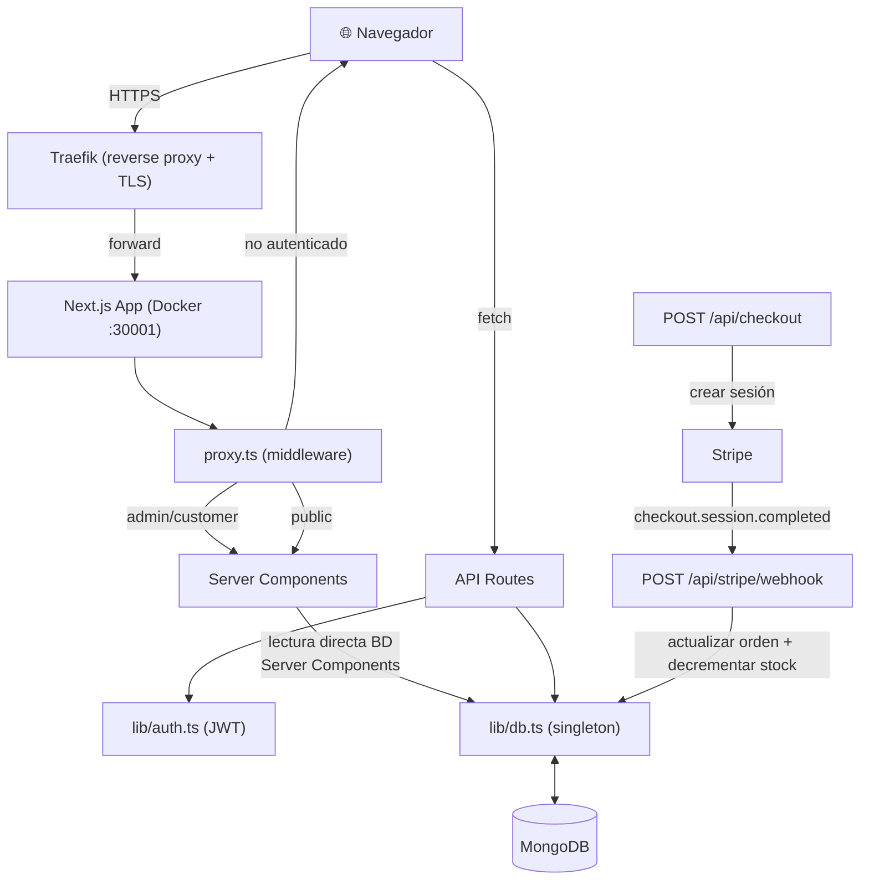

# Aplicación Ecommerce — MISEIA 1-4-110

Aplicación web de comercio electrónico completa construida con **Next.js 16 / React 19**, respaldada por **MongoDB**, pagos con **Stripe** y autenticación basada en JWT. Incluye panel de administración, catálogo de productos, carrito de compras y flujo completo de checkout.

**URL de producción:** [https://ecommerce.deviaaps.com](https://ecommerce.deviaaps.com)

---

## Funcionalidades Implementadas

### 1. Autenticación y Autorización
Sesiones basadas en cookies con JWT firmado (vía `jose`) y hash de contraseñas con `bcrypt`. Dos roles: `admin` y `customer`. El middleware (`proxy.ts`) protege todas las rutas `/admin/*`, `/cart` y `/orders`, redirigiendo a usuarios no autenticados hacia `/login`.

### 2. Catálogo de Productos y Carrito de Compras
Catálogo público con navegación por categorías y páginas de detalle por producto. Los clientes autenticados pueden agregar artículos a un carrito persistente respaldado en MongoDB, actualizar cantidades y eliminar artículos mediante llamadas a la API REST desde Client Components.

### 3. Stripe Checkout y Webhooks
Al hacer checkout, se crea una orden `pending` en MongoDB y se abre una Stripe Checkout Session (página alojada por Stripe). El endpoint de webhook (`/api/stripe/webhook`) maneja el evento `checkout.session.completed` para marcar las órdenes como `paid` y decrementar el stock de productos de forma atómica.

### 4. Panel de Administración
CRUD completo sobre productos y gestión del estado de órdenes. El dashboard muestra estadísticas clave (ingresos totales, órdenes, productos, clientes) obtenidas directamente de MongoDB en Server Components.

---

## Estructura del Proyecto

```
ecommerce/
├── app/
│   ├── (public)/
│   │   ├── page.tsx                        ← Inicio / catálogo de productos
│   │   ├── login/page.tsx                  ← Formulario de inicio de sesión
│   │   ├── register/page.tsx               ← Formulario de registro
│   │   └── products/[id]/
│   │       ├── page.tsx                    ← Detalle de producto
│   │       └── AddToCartButton.tsx         ← Client Component para carrito
│   ├── (customer)/
│   │   ├── cart/page.tsx                   ← Carrito de compras
│   │   ├── orders/page.tsx                 ← Historial de órdenes del cliente
│   │   └── checkout/
│   │       ├── success/page.tsx            ← Pago exitoso
│   │       └── cancel/page.tsx             ← Pago cancelado
│   ├── (admin)/
│   │   └── admin/
│   │       ├── layout.tsx                  ← Layout con sidebar oscuro
│   │       ├── page.tsx                    ← Dashboard con estadísticas
│   │       ├── products/page.tsx           ← Lista de productos + CRUD
│   │       ├── products/new/page.tsx       ← Crear producto
│   │       ├── products/[id]/edit/page.tsx ← Editar producto
│   │       ├── orders/page.tsx             ← Todas las órdenes + estado
│   │       └── customers/page.tsx          ← Lista de clientes
│   ├── api/
│   │   ├── auth/login/route.ts             ← POST login → cookie JWT
│   │   ├── auth/logout/route.ts            ← POST logout → borrar cookie
│   │   ├── auth/register/route.ts          ← POST registro
│   │   ├── cart/route.ts                   ← GET / POST / DELETE carrito
│   │   ├── checkout/route.ts               ← POST → crear sesión Stripe
│   │   ├── stripe/webhook/route.ts         ← Manejador de webhooks Stripe
│   │   ├── admin/products/route.ts         ← GET lista / POST crear
│   │   ├── admin/products/[id]/route.ts    ← GET / PUT / DELETE por ID
│   │   ├── admin/orders/route.ts           ← GET todas las órdenes
│   │   └── admin/orders/[id]/route.ts      ← GET / PUT orden por ID
│   ├── components/Header.tsx               ← Navegación con estado de auth
│   ├── layout.tsx                          ← Layout raíz (fuentes, globals)
│   └── page.tsx                            ← Catálogo / landing
├── lib/
│   ├── db.ts                               ← Singleton de MongoDB
│   ├── auth.ts                             ← Helpers JWT crear / verificar
│   └── types.ts                            ← Interfaces TypeScript del dominio
├── __tests__/
│   └── unit/
│       ├── auth.test.ts                    ← 9 tests JWT y cookies
│       ├── money.test.ts                   ← 6 tests modelo cents-first
│       └── api-validation.test.ts          ← 12 tests validación de rutas API
├── docs/
│   ├── adr/                                ← 6 Architecture Decision Records
│   ├── compliance/                         ← Reporte de cumplimiento + PERT
│   └── AI-USAGE.md                         ← Registro de uso de IA
├── scripts/
│   └── seed.ts                             ← Seed de BD (usuarios, productos, órdenes)
├── proxy.ts                                ← Middleware de protección de rutas
├── Dockerfile                              ← Build multi-stage para producción
├── .github/workflows/ci-cd.yml            ← Pipeline GitHub Actions
├── .gitlab-ci.yml                          ← Pipeline GitLab CI
├── vitest.config.ts                        ← Configuración de Vitest
├── next.config.ts                          ← Configuración de Next.js
├── package.json                            ← Dependencias y scripts npm
├── package-lock.json                       ← Lockfile de npm (reproducibilidad exacta)
├── .env.example                            ← Plantilla de variables de entorno
└── .env.local                              ← Variables de entorno (no versionado)
```

---

## Arquitectura del Sistema



---

## Patrones de Diseño / Arquitectura

- **Singleton (conexión DB)** — `lib/db.ts` mantiene una única instancia de `MongoClient` para evitar agotamiento de conexiones en desarrollo y reconexiones innecesarias en producción.
- **Repositorio vía Route Handlers** — todas las mutaciones de BD se encapsulan en route handlers de la API; los Server Components consultan MongoDB directamente para lecturas, manteniendo la obtención de datos co-ubicada con el renderizado.
- **Control de Acceso Basado en Roles** — `proxy.ts` inspecciona el JWT en cada solicitud antes de que llegue a una página, aplicando la separación de rutas admin/customer a nivel de middleware del framework.
- **Modelo de dinero cents-first** — todos los precios y totales se almacenan como enteros (centavos) en MongoDB; el formato (`$XX.XX`) ocurre exclusivamente en la capa de renderizado para prevenir deriva de punto flotante.
- **Patrón Stripe Checkout + Webhook** — el estado de la orden es manejado por eventos de Stripe, no por redirecciones del cliente, garantizando que la confirmación de pago sea confiable incluso si el usuario cierra el navegador.

---

## Primeros Pasos

### Prerequisitos

| Herramienta | Versión |
|---|---|
| Node.js | 20+ |
| MongoDB | 7+ (local o Atlas) |
| Cuenta Stripe | Cualquiera (modo test) |

### Clonar e instalar

```bash
git clone https://github.com/Jorgeaapaz/MISEIA_1-4-110-ecommerce.git
cd MISEIA_1-4-110-ecommerce
npm install
```

> El archivo `package-lock.json` está incluido en el repositorio para garantizar instalaciones reproducibles. Siempre usa `npm ci` en entornos de CI/CD para respetar las versiones exactas del lockfile.

### Configurar variables de entorno

```bash
cp .env.example .env.local
```

Luego edita `.env.local` con tus valores reales (ver `.env.example` para descripción de cada variable):

```env
MONGODB_URI=mongodb://localhost:27017
MONGODB_DB=ecommerce
AUTH_SECRET=reemplaza-con-string-aleatorio-32-chars
NEXT_PUBLIC_BASE_URL=http://localhost:3000
NEXT_PUBLIC_STRIPE_PUBLISHABLE_KEY=pk_test_tu_clave_publicable
STRIPE_PUBLISHABLE_KEY=pk_test_tu_clave_publicable
STRIPE_SECRET_KEY=sk_test_tu_clave_secreta
STRIPE_WEBHOOK_SECRET=whsec_tu_secreto_de_webhook
```

### Sembrar la base de datos

```bash
npx tsx scripts/seed.ts
```

Esto crea:
- 1 admin: `admin@shop.com` / `admin123`
- 5 clientes: `customer1@shop.com` … `customer5@shop.com` / `pass1234`
- 15 productos en categorías Electronics, Books y Home
- 5 órdenes de ejemplo en distintos estados

### Ejecutar el servidor de desarrollo

```bash
npm run dev
```

Abre [http://localhost:3000](http://localhost:3000).

Para webhooks de Stripe en local, usa el Stripe CLI:

```bash
stripe listen --forward-to localhost:3000/api/stripe/webhook
```

---

## Scripts Disponibles

| Comando | Descripción |
|---|---|
| `npm run dev` | Servidor de desarrollo con hot-reload |
| `npm run build` | Build de producción (Next.js standalone) |
| `npm start` | Inicia el servidor de producción |
| `npm run lint` | Ejecuta ESLint |
| `npm test` | Ejecuta tests (Vitest, 27 tests) |
| `npm run test:watch` | Tests en modo watch |
| `npm run test:coverage` | Tests con reporte de cobertura |
| `npm run seed` | Siembra la base de datos |

---

## Flujos de Ejemplo

### Compra exitosa

1. Registrarse o iniciar sesión como cliente
2. Navegar el catálogo → clic en un producto → **Agregar al Carrito**
3. Ir al **Carrito** → **Checkout** → redirigido a la página Stripe
4. Usar tarjeta de prueba `4242 4242 4242 4242` (fecha futura, cualquier CVC)
5. Redirigido a `/checkout/success` — estado de orden actualizado a `paid` vía webhook

### Gestión de productos (Admin)

1. Iniciar sesión como `admin@shop.com` / `admin123`
2. Navegar a `/admin/products` → clic en **Nuevo Producto**
3. Completar nombre, descripción, precio (en dólares, almacenado en centavos), stock, categoría
4. El producto aparece en el catálogo inmediatamente (re-fetch del Server Component)

### Checkout cancelado

1. Iniciar checkout → clic en **Volver** en la página de Stripe
2. Redirigido a `/checkout/cancel`
3. La orden permanece como `pending` en la BD; el carrito se conserva

---

## Stack Tecnológico

| Capa | Tecnología |
|---|---|
| Framework | Next.js 16 (App Router) + React 19 |
| Base de Datos | MongoDB 7 (driver nativo, sin ORM) |
| Autenticación | JWT vía `jose` + `bcrypt` |
| Pagos | Stripe Checkout + Webhooks |
| Estilos | Tailwind CSS 4 |
| Lenguaje | TypeScript 5 |
| Testing | Vitest + @vitest/coverage-v8 |
| Contenedores | Docker (build multi-stage, standalone output) |
| CI/CD | GitHub Actions + GitLab CI |
| Proxy Inverso | Traefik v3 (TLS wildcard *.deviaaps.com) |

---

## Cobertura de Tests

Ejecuta con `npm test` (27 tests) o `npm run test:coverage` para reporte de cobertura:

| Archivo | Sentencias | Funciones | Líneas |
|---|---|---|---|
| `lib/auth.ts` | 67% | 75% | 71% |
| `app/api/auth/login` | 57% | 100% | 57% |
| `app/api/cart` | 39% | 80% | 40% |
| `app/api/auth/register` | 31% | 100% | 31% |

La cobertura es parcial de forma intencional — las rutas que requieren MongoDB activo están cubiertas por tests de validación con DB mockeada; los tests de integración contra una BD real son una iteración futura.

---

## Decisiones de Arquitectura

Ver [`docs/adr/`](docs/adr/) para los Architecture Decision Records que cubren:
- [MongoDB sobre PostgreSQL](docs/adr/001-mongodb-over-postgresql.md)
- [JWT en Cookies sobre Session Store](docs/adr/002-jwt-cookies-over-session-store.md) *(incluye benchmarks de latencia)*
- [Driver nativo MongoDB sobre Mongoose](docs/adr/003-native-mongodb-driver-over-mongoose.md)
- [Next.js App Router + Server Components](docs/adr/004-nextjs-app-router-server-components.md) *(incluye datos de tamaño de bundle)*
- [Stripe Checkout sobre Elements](docs/adr/005-stripe-checkout-over-elements.md)
- [Modelo de Dinero Cents-First](docs/adr/006-cents-first-money-model.md) *(incluye prueba de precisión de flotantes)*

---

## Uso de Inteligencia Artificial

Este proyecto fue construido con asistencia de IA (Claude Code). Ver [`docs/AI-USAGE.md`](docs/AI-USAGE.md) para un registro detallado del código generado por IA y las correcciones críticas aplicadas.

---

## Despliegue

### URL en Producción

**[https://ecommerce.deviaaps.com](https://ecommerce.deviaaps.com)**

### Build Local con Docker

```bash
docker build -t ecommerce:latest .
docker run -p 30001:30001 --env-file .env.local ecommerce:latest
# Abrir http://localhost:30001
```

### Despliegue en Producción (VM GCI — ecommerce.deviaaps.com)

**Prerequisitos:** Acceso SSH a `gcvmuser@34.174.56.186`, Traefik y red `miseia-net` corriendo en la VM.

```bash
# 1. Conectarse a la VM
ssh -i ~/.ssh/vboxuser gcvmuser@34.174.56.186

# 2. Clonar repositorio (solo primera vez)
git clone https://github.com/Jorgeaapaz/MISEIA_1-4-110-ecommerce.git ~/MISEIA110_ecommerce
cd ~/MISEIA110_ecommerce

# 3. Crear archivo de entorno de producción
cp .env.example .env.production
nano .env.production   # completar con valores reales

# 4. Build y arranque del contenedor
docker build -t ecommerce:latest .
TRAEFIK_RULE='traefik.http.routers.ecommerce.rule=Host(`ecommerce.deviaaps.com`)'
docker run -d \
  --name ecommerce \
  --network miseia-net \
  --restart unless-stopped \
  --env-file .env.production \
  --label traefik.enable=true \
  --label "$TRAEFIK_RULE" \
  --label traefik.http.routers.ecommerce.entrypoints=websecure \
  --label traefik.http.routers.ecommerce.tls=true \
  --label traefik.http.routers.ecommerce.tls.certresolver=cloudflare \
  --label traefik.http.services.ecommerce.loadbalancer.server.port=30001 \
  ecommerce:latest

# 5. Sembrar BD de producción (solo primer despliegue)
docker exec ecommerce npx tsx scripts/seed.ts

# 6. Verificar
curl -I https://ecommerce.deviaaps.com
```

> **Importante:** Siempre usa la variable `TRAEFIK_RULE` con comillas simples para evitar que el shell interprete los backticks del `Host(...)` como sustitución de comandos.

### Despliegue Continuo (CI/CD)

Después de la configuración inicial, los pushes a `main` son compilados y desplegados automáticamente vía:

- **GitHub Actions:** `.github/workflows/ci-cd.yml` (test → build → deploy)
  - Secrets requeridos: `SSH_PRIVATE_KEY`, `MONGODB_URI`, `MONGODB_DB`, `AUTH_SECRET`, `NEXT_PUBLIC_BASE_URL`, `NEXT_PUBLIC_STRIPE_PUBLISHABLE_KEY`, `STRIPE_PUBLISHABLE_KEY`, `STRIPE_SECRET_KEY`, `STRIPE_WEBHOOK_SECRET`
- **GitLab CI:** `.gitlab-ci.yml` (test → build → deploy)
  - Variables CI/CD requeridas: las mismas que GitHub secrets

### Webhook de Stripe (Producción)

Registra el webhook en el [Dashboard de Stripe](https://dashboard.stripe.com/webhooks):
- **Endpoint:** `https://ecommerce.deviaaps.com/api/stripe/webhook`
- **Eventos:** `checkout.session.completed`
- Copiar el secreto de firma → actualizar `STRIPE_WEBHOOK_SECRET` en `.env.production`

---

## Colecciones de MongoDB

| Colección | Campos principales |
|---|---|
| `users` | `_id`, `email`, `passwordHash`, `role` (`admin`\|`customer`), `name`, `createdAt` |
| `products` | `_id`, `name`, `description`, `price` (centavos), `stock`, `category`, `active` |
| `orders` | `_id`, `customerId`, `items [{productId, name, qty, unitPrice}]`, `total`, `status` (`pending`\|`paid`\|`shipped`\|`cancelled`), `stripeSessionId`, `createdAt` |
| `carts` | `_id`, `customerId`, `items [{productId, name, qty, unitPrice}]`, `updatedAt` |

---

## Updates — 2026-06-27

- `docs/RETROSPECTIVE-2026-06-27.md` added — full English session retrospective covering compliance evaluation, PERT execution, all bugs found and fixed (Stripe lazy init, `force-dynamic`, Traefik backtick label stripping, GitLab `builds_access_level`, GitHub SSH secrets), and recommendations for future sessions.
- `.github/workflows/ci-cd.yml` and `.gitlab-ci.yml` updated — deploy step now writes a shell script to the VM before executing it, preventing Traefik `Host()` label backtick stripping through SSH heredocs.
- Both GitHub Actions and GitLab CI pipelines fully green (lint → test → build → deploy).
- Production site `https://ecommerce.deviaaps.com` confirmed HTTP 200.
