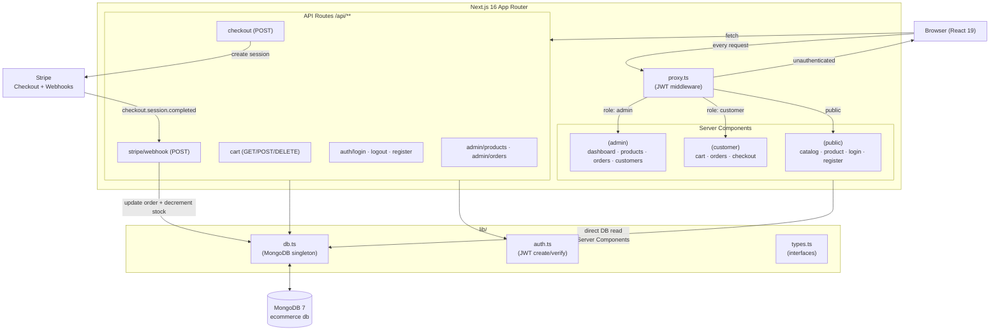

# Ecommerce App

A full-featured **Next.js 16 / React 19** ecommerce web application that supports product catalog browsing, shopping cart management, Stripe-powered checkout, and a complete admin panel — all backed by MongoDB with role-based JWT authentication.

---

## Features Implemented

### 1. Authentication & Authorization
Cookie-based session auth using signed JWTs (via `jose`) and `bcrypt` password hashing. Two roles: `admin` and `customer`. Middleware (`proxy.ts`) guards all `/admin/*` and `/cart`, `/orders` routes, redirecting unauthenticated users to `/login`.

### 2. Product Catalog & Shopping Cart
Public product catalog with category browsing and per-product detail pages. Authenticated customers can add items to a persistent MongoDB-backed cart, update quantities, and remove items via REST API calls from Client Components.

### 3. Stripe Checkout & Webhooks
On checkout, a `pending` order is created in MongoDB and a Stripe Checkout Session is opened (hosted page). The webhook endpoint (`/api/stripe/webhook`) handles `checkout.session.completed` events to mark orders as `paid` and decrement product stock atomically.

### 4. Admin Dashboard
Full CRUD over products and order status management. The admin dashboard displays key stats (total revenue, orders, products, customers) fetched directly from MongoDB in Server Components.

---

## Project Structure

```
ecommerce/
├── app/
│   ├── (public)/
│   │   ├── page.tsx                        ← Home / product catalog
│   │   ├── login/page.tsx                  ← Login form
│   │   ├── register/page.tsx               ← Registration form
│   │   └── products/[id]/
│   │       ├── page.tsx                    ← Product detail page
│   │       └── AddToCartButton.tsx         ← Client Component for cart action
│   ├── (customer)/
│   │   ├── cart/page.tsx                   ← Shopping cart
│   │   ├── orders/page.tsx                 ← Customer order history
│   │   └── checkout/
│   │       ├── success/page.tsx            ← Payment success
│   │       └── cancel/page.tsx             ← Payment cancelled
│   ├── (admin)/
│   │   └── admin/
│   │       ├── layout.tsx                  ← Dark sidebar admin layout
│   │       ├── page.tsx                    ← Dashboard with stats
│   │       ├── products/page.tsx           ← Product list + CRUD
│   │       ├── products/new/page.tsx       ← Create product form
│   │       ├── products/[id]/edit/page.tsx ← Edit product form
│   │       ├── orders/page.tsx             ← All orders + status update
│   │       └── customers/page.tsx          ← Customer list
│   ├── api/
│   │   ├── auth/login/route.ts             ← POST login → set JWT cookie
│   │   ├── auth/logout/route.ts            ← POST logout → clear cookie
│   │   ├── auth/register/route.ts          ← POST register
│   │   ├── cart/route.ts                   ← GET / POST / DELETE cart
│   │   ├── checkout/route.ts               ← POST → create Stripe session
│   │   ├── stripe/webhook/route.ts         ← Stripe webhook handler
│   │   ├── admin/products/route.ts         ← GET list / POST create
│   │   ├── admin/products/[id]/route.ts    ← GET / PUT / DELETE by ID
│   │   ├── admin/orders/route.ts           ← GET all orders
│   │   └── admin/orders/[id]/route.ts      ← GET / PUT order by ID
│   ├── components/Header.tsx               ← Nav header with auth state
│   ├── layout.tsx                          ← Root layout (fonts, globals)
│   └── page.tsx                            ← Landing / product catalog
├── lib/
│   ├── db.ts                               ← MongoDB singleton client
│   ├── auth.ts                             ← JWT create / verify helpers
│   └── types.ts                            ← TypeScript domain interfaces
├── scripts/
│   └── seed.ts                             ← DB seed (users, products, orders)
├── proxy.ts                                ← Route protection middleware
├── next.config.ts                          ← Next.js configuration
├── postcss.config.mjs                      ← Tailwind CSS / PostCSS config
└── .env.local                              ← Environment variables
```

---

## Design Patterns / Architecture

- **Singleton (DB connection)** — `lib/db.ts` caches the `MongoClient` instance across hot-reloads to avoid connection exhaustion in development and unnecessary reconnections in production.
- **Repository via Route Handlers** — all DB mutations are encapsulated in API route handlers; Server Components query MongoDB directly for reads, keeping data-fetching co-located with rendering.
- **Role-Based Access Control** — `proxy.ts` inspects the JWT on every request before it reaches a page, enforcing admin/customer route separation at the framework middleware layer.
- **Cents-first money model** — all prices and totals are stored as integers (cents) in MongoDB; formatting (`$XX.XX`) happens exclusively at the render layer to prevent floating-point drift.
- **Stripe Checkout + Webhook pattern** — order state is driven by Stripe events, not client redirects, ensuring payment confirmation is reliable even if the user closes their browser.

---

## How It Works

A customer browses the catalog (Server Component reads MongoDB directly), adds items to their cart (Client Component → `POST /api/cart`), then triggers a Stripe Checkout Session (`POST /api/checkout` creates a `pending` order and returns a Stripe URL). After payment, Stripe fires `checkout.session.completed` to `/api/stripe/webhook`, which atomically marks the order `paid` and decrements product stock.

```typescript
// POST /api/checkout — simplified flow
const order = await db.collection('orders').insertOne({
  customerId: new ObjectId(user.userId),
  items: cart.items,
  total: cart.items.reduce((s, i) => s + i.qty * i.unitPrice, 0),
  status: 'pending',
  stripeSessionId: null,
  createdAt: new Date(),
});

const session = await stripe.checkout.sessions.create({
  line_items: cart.items.map(item => ({
    price_data: {
      currency: 'usd',
      product_data: { name: item.name },
      unit_amount: item.unitPrice,   // already in cents
    },
    quantity: item.qty,
  })),
  mode: 'payment',
  metadata: { orderId: order.insertedId.toString() },
  success_url: `${process.env.NEXT_PUBLIC_BASE_URL}/checkout/success`,
  cancel_url:  `${process.env.NEXT_PUBLIC_BASE_URL}/checkout/cancel`,
});

return NextResponse.json({ url: session.url });
```

---

## Architecture



## Getting Started

### Prerequisites

| Tool | Version |
|---|---|
| Node.js | 20+ |
| MongoDB | 7+ (local or Atlas) |
| Stripe account | Any (test mode) |

### Clone & install

```bash
git clone https://github.com/Jorgeaapaz/MISEIA_1-4-110-ecommerce.git
cd MISEIA_1-4-110-ecommerce
npm install
```

### Configure environment variables

```bash
cp .env.example .env.local
```

Then edit `.env.local` with your real values (see `.env.example` for descriptions of each variable).

### Seed the database

```bash
npx tsx scripts/seed.ts
```

This creates:
- 1 admin: `admin@shop.com` / `admin123`
- 5 customers: `customer1@shop.com` … `customer5@shop.com` / `pass1234`
- 15 products across Electronics, Books, and Home categories
- 5 sample orders in various statuses

### Run the development server

```bash
npm run dev
```

Open [http://localhost:3000](http://localhost:3000).

For Stripe webhooks locally, use the Stripe CLI:

```bash
stripe listen --forward-to localhost:3000/api/stripe/webhook
```

---

## Example Flows

### Successful purchase

1. Register or log in as a customer
2. Browse the catalog → click a product → **Add to Cart**
3. Go to **Cart** → **Checkout** → redirected to Stripe hosted page
4. Use test card `4242 4242 4242 4242` (any future date, any CVC)
5. Redirected to `/checkout/success` — order status updated to `paid` via webhook

### Admin product management

1. Log in as `admin@shop.com` / `admin123`
2. Navigate to `/admin/products` → click **New Product**
3. Fill in name, description, price (dollars displayed, stored as cents), stock, category
4. Product appears in the catalog immediately (Server Component re-fetch)

### Failed / cancelled checkout

1. Start checkout → click **Back** on the Stripe page
2. Redirected to `/checkout/cancel`
3. Order remains `pending` in the database; cart is preserved

---

## Tech Stack

| Layer | Technology |
|---|---|
| Framework | Next.js 16 (App Router) + React 19 |
| Database | MongoDB 7 (native driver, no ORM) |
| Auth | JWT via `jose` + `bcrypt` |
| Payments | Stripe Checkout + Webhooks |
| Styling | Tailwind CSS 4 |
| Language | TypeScript 5 |
