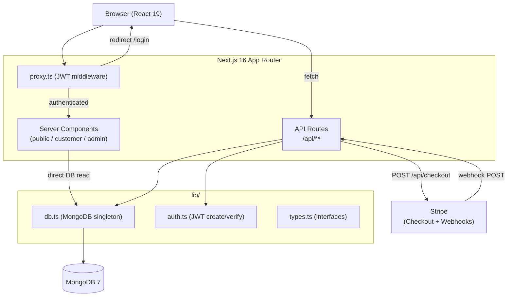

@~/.claude/prompts/new_functionality_prompt_spec.md

# Add Architecture Diagram to README

## Role
Act as a Software Architect with expertise in system design documentation and Mermaid diagrams.

## Context
Project: `1-4-110-ecommerce` — Next.js 16 ecommerce app at `D:\Master-IA-Dev\04-Bloque4\1-4-110-ecommerce\ecommerce`.

This resolves `dc_diagrama_arquitectura` — a diagram showing components and main flows.

Current architecture:
- **Client:** Browser (React 19 Server Components + Client Components)
- **Framework:** Next.js 16 App Router (SSR + API Routes)
- **Auth:** JWT via `jose` + `bcrypt`, `proxy.ts` middleware
- **Database:** MongoDB 7 (native driver, singleton in `lib/db.ts`)
- **Payments:** Stripe Checkout Sessions + Webhooks
- **Route groups:** `(public)`, `(customer)`, `(admin)`
- **Production:** Docker container behind Traefik on GCI VM

## Task
Add a Mermaid architecture diagram to `README.md` under a new "Architecture" section, placed after "How It Works". The diagram must show:
1. Client → Next.js App Router (pages + API routes)
2. `proxy.ts` middleware intercepting requests
3. Server Components → MongoDB direct reads
4. Client Components → API Routes → MongoDB
5. Checkout flow → Stripe → Webhook → MongoDB
6. `lib/` layer (db, auth, types)

### Diagram Guidelines
- Use Mermaid `graph TD` or `sequenceDiagram` as appropriate.
- Keep it readable — max 20 nodes.
- Use subgraphs to group: `Next.js App`, `lib/`, `External Services`.
- Do not use images — Mermaid renders in GitHub markdown natively.

## Output format
Update `README.md` — add a "## Architecture" section with a Mermaid code block:

## Output checklist and Guardrails
- [ ] Mermaid diagram added to `README.md` under "## Architecture" section
- [ ] Diagram renders correctly in GitHub preview
- [ ] Diagram includes: middleware, server components, API routes, MongoDB, Stripe
- [ ] Diagram uses subgraphs for logical grouping
- [ ] No external image hosting — pure Mermaid
- [ ] Commit: `docs: add Mermaid architecture diagram to README`
